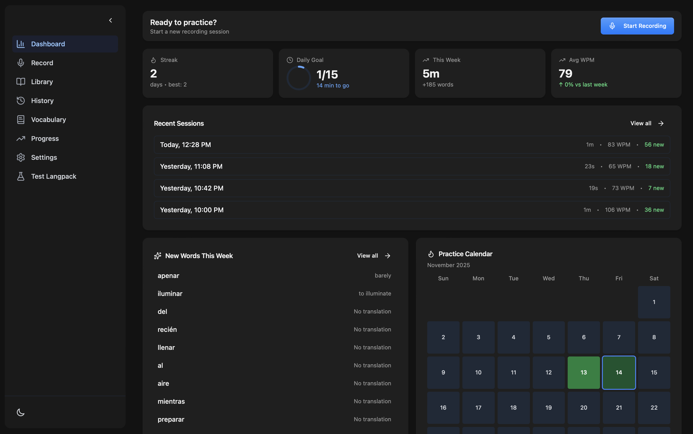
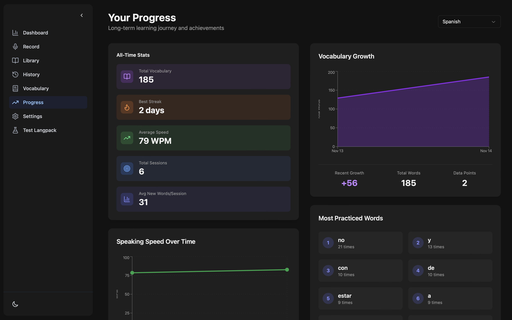
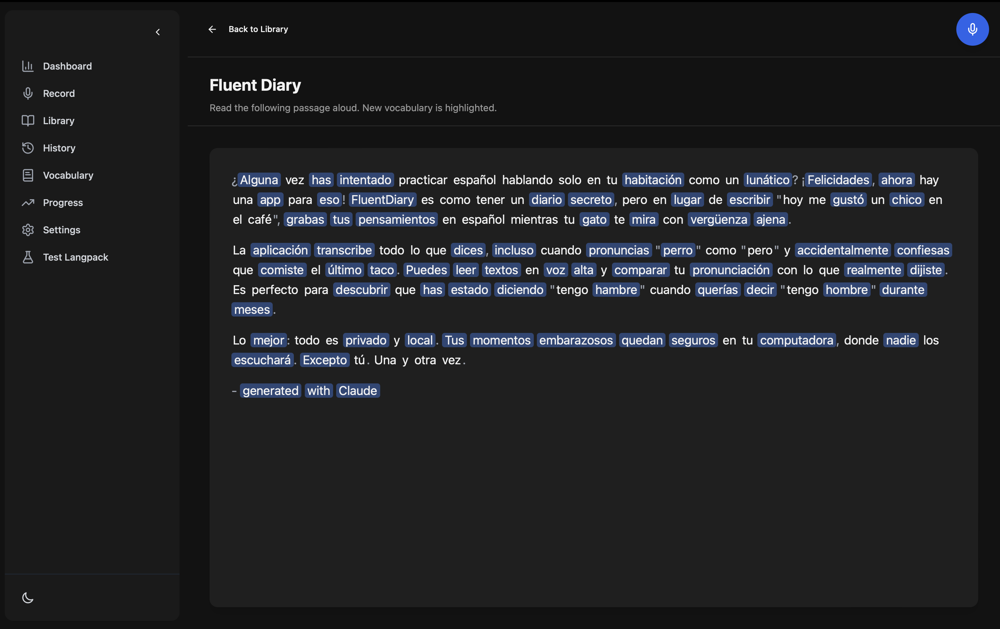

# FluentDiary

[](https://github.com/Thxamillion/fluentdiary-desktop/releases/latest)
[](https://discord.gg/ZFwngNpk3A)
[](https://reddit.com/r/fluentdiary)
[](LICENSE)
[](https://tauri.app)
[](https://github.com/Thxamillion/fluentdiary-desktop)

**Practice speaking your target language. Track progress. Improve faster.**

FluentDiary is a free, open-source desktop app that helps language learners build speaking confidence through daily practice. Record yourself speaking, get instant transcripts and speaking metrics, and watch your vocabulary grow—all completely offline.



##  Why FluentDiary?

- **🎤 Speak daily** - Build the speaking habit without pressure. Talk about your day, practice pronunciation, or record your thoughts in your target language.
- **📊 Track real progress** - See concrete improvements in speaking speed (WPM), vocabulary growth, and session history over time.
- **🔒 100% local** - All transcription and processing happens on your device. No cloud, no subscriptions, no data sharing.
- **📖 Read aloud** - Import articles, books, or any text and practice reading fluently with instant feedback.
- **🌍 Multiple languages** - Supports English, Spanish, German, Italian, French, and more to come.

## 📥 Installation

### Download

**macOS:**
- [Download for Apple Silicon (M1/M2/M3)](https://github.com/Thxamillion/fluentdiary-desktop/releases/latest) - macOS 11+
- [Download for Intel](https://github.com/Thxamillion/fluentdiary-desktop/releases/latest) - macOS 11+

**Windows:**
- [Download for Windows](https://github.com/Thxamillion/fluentdiary-desktop/releases/latest) - Windows 10+

**Linux:**
- [Download AppImage](https://github.com/Thxamillion/fluentdiary-desktop/releases/latest)
- [Download .deb](https://github.com/Thxamillion/fluentdiary-desktop/releases/latest)

### Build from Source

```bash
# Prerequisites: Node.js 18+, Rust 1.70+
git clone https://github.com/Thxamillion/fluentdiary-desktop.git
cd fluentdiary-desktop
npm install
npm run tauri build
```

See [CONTRIBUTING.md](CONTRIBUTING.md) for detailed development setup.

## 🚀 Quick Start

1. **Download and install** the app for your platform
2. **Choose your Whisper model**
   - First launch will prompt you to download a model
   - **Base (142 MB)** - Recommended for older machines, less accuracy
   - **Small (466 MB)** - Recommended for most users, more accuracy
   - **Large models** - Best accuracy, requires more RAM
3. **Set your languages**
   - Select your native language (for translations)
   - Select your target language (what you're learning)
4. **Start practicing!**
   - Click "Record" and talk about your day
   - Use "Read Aloud" to practice with imported text
   - Check your dashboard to see progress over time

That's it! All your recordings, transcripts, and progress stay on your device.

## ✨ Features

### 🎤 Recording & Transcription
- **Local speech-to-text** using OpenAI's Whisper (runs entirely on your device)
- **High-quality audio recording** with automatic processing
- **Instant transcripts** with word-level timestamps
- **Session history** - Review all your past recordings and transcripts

### 📊 Progress Tracking
- **Speaking speed (WPM)** - Track your words-per-minute over time
- **Session analytics** - Duration, word count, and speaking patterns
- **Progress dashboard** - Visualize your improvement with charts and trends
- **Vocabulary growth** - See your expanding vocabulary over time

### 📚 Vocabulary Learning
- **Automatic word discovery** - New words are detected and saved automatically
- **Translations** - Get instant translations for discovered words
- **Lemmatization** - Words are grouped by their base form (e.g., "running" → "run")
- **Usage tracking** - See which words you use most often

### 📖 Read Aloud Mode
- **Text library** - Import articles, books, or any content you want to practice with
- **Guided practice** - Read at your own pace with live transcription
- **Pronunciation feedback** - Compare what you said vs. what you meant to say

## 🚧 Upcoming Features

Todo items:

- [ ] **Filler word detection** - Track "um", "uh", "like" and the like to reduce their usage
- [ ] **Sentence complexity analysis** - See how your sentence structure improves
- [ ] **Audio playback with highlights** - Click on transcript words to jump to that point in audio
- [ ] **Export data** - Export sessions/vocabulary to CSV/JSON
- [ ] **More languages** - Expanding language pack support

Want to help build these? See [CONTRIBUTING.md](CONTRIBUTING.md) or check out [open issues](https://github.com/Thxamillion/fluentdiary-desktop/issues?q=is%3Aissue+is%3Aopen+label%3Aenhancement).

**Have a feature idea?** [Open an issue](https://github.com/Thxamillion/fluentdiary-desktop/issues/new) and let's discuss!

## 📸 Screenshots

### Dashboard
Track your speaking progress over time with detailed analytics and visualizations.


### Progress Tracking
Visualize your improvement with charts showing speaking speed, session history, and vocabulary growth.



### Read Aloud Mode
Practice pronunciation with your own imported texts and get instant feedback.



## 🏗️ How It Works

FluentDiary is built with modern technologies focused on performance and privacy:

### Tech Stack
- **[Tauri](https://tauri.app/)** - Lightweight desktop framework (Rust + Web)
- **[Whisper.cpp](https://github.com/ggerganov/whisper.cpp)** - Local speech-to-text engine
- **React + TypeScript** - Modern, type-safe UI
- **[TanStack Query](https://tanstack.com/query)** - Data fetching and state management
- **IndexedDB** - Local storage for all your data

### Architecture
All transcription happens **on your device** using OpenAI's Whisper model. No internet connection required after downloading a model. Your recordings, transcripts, and vocabulary are stored locally in IndexedDB—we don't have servers to send data to.

## 🤝 Contributing

We welcome contributions! See [CONTRIBUTING.md](CONTRIBUTING.md) for guidelines on:
- Setting up the development environment
- Code standards and architecture
- Submitting pull requests

**Good first issues:** Check out issues labeled [`good first issue`](https://github.com/Thxamillion/fluentdiary-desktop/issues?q=is%3Aissue+is%3Aopen+label%3A%22good+first+issue%22)

## 📄 License

MIT License - see [LICENSE](LICENSE) for details.

## 🙏 Credits

- Inspired by [Epicenter Whispering](https://github.com/epicenter-md/epicenter)
- Built with [Whisper.cpp](https://github.com/ggerganov/whisper.cpp)
- Language data from [Kaikki.org](https://kaikki.org/)

---

**Made with ❤️ for language learners**
